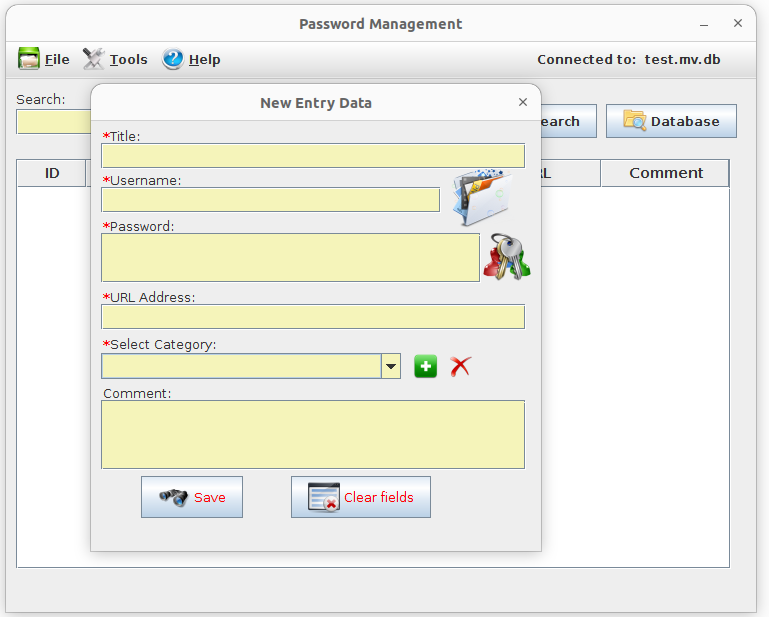
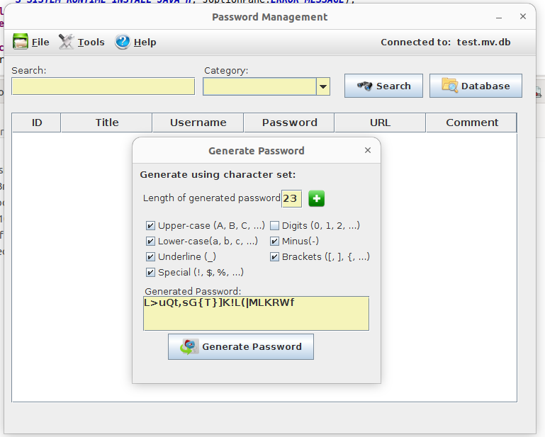

# Java SWING password manager
Minimal desktop application developed with Java Swing for password management using Java 1.8

 
#### Info:
 - In order for the part of sending the password by email to also work, it is necessary to complete the settings for the email server in config.properties